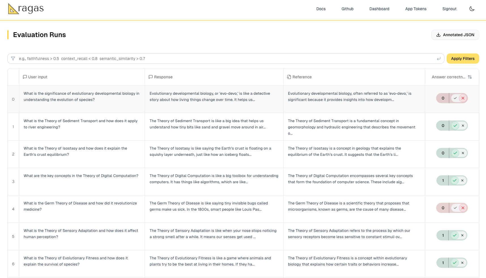
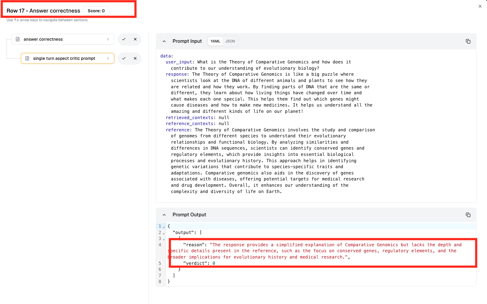
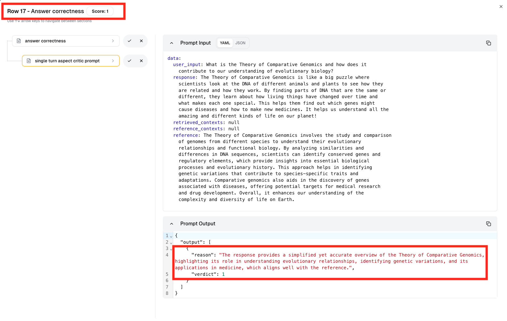

## Train your own metric

LLM as judge metric often makes mistakes and lack alignment with human evaluators. This makes them risky to use as their results cannot be trusted fully. Now, you can fix this using ragas. This simple tutorial notebook showcasing how to train and align any LLM as judge metric using ragas. One can use this to train any LLM based metric in ragas. 


### Import required modules


```python
import os
from datasets import load_dataset
from ragas import evaluate, EvaluationDataset
from ragas.metrics import AspectCritic

```


Now, sign up for a free account at [app.ragas](https://app.ragas.io) and get your API key.
Navigate to App tokens -> Create new token. Copy the key and paste it in the below code. Store it safely.


```python
os.environ['RAGAS_APP_TOKEN'] = 'your_app_token'
```

### Setup the models used for evaluation and training
You may choose any LLM model for training and evaluation. Here's [how to do it](../customize_models.md)


```python
from ragas.llms import LangchainLLMWrapper
from ragas.embeddings import LangchainEmbeddingsWrapper
from langchain_openai import ChatOpenAI
from langchain_openai import OpenAIEmbeddings
llm = LangchainLLMWrapper(ChatOpenAI(model="gpt-4o-mini"))
embeddings = LangchainEmbeddingsWrapper(OpenAIEmbeddings())
```

### Load sample evaluation dataset
Here, we are loading the sample dataset for evaluation. You can replace it with your own dataset. 


```python
dataset = load_dataset("explodinggradients/ELI5",split="test")
eval_dataset = EvaluationDataset.from_hf_dataset(dataset)
```

### Setup the Metric
You may use any LLM based metric. For simplicity, I am using aspect critic metric and setting it up so that it can compare the response with the reference.


```python
critic = AspectCritic(name="answer_correctness",definition="Given the user_input, reference and response. Is the response correct compared with the reference",llm=llm)

```

### Evaluate and Upload the results


```python
results = evaluate(eval_dataset,metrics=[critic])

```

    Evaluating: 100%|██████████████████████████████████████████████████████████| 56/56 [00:01<00:00,  3.49it/s]


```python
results.upload()
```

Evaluation results uploaded! View at https://app.ragas.io/dashboard/alignment/evaluation/a6baf6ff-027f-4097-89e3-e11c70b8cf61
'https://app.ragas.io/dashboard/alignment/evaluation/a6baf6ff-027f-4097-89e3-e11c70b8cf61'


### Review and annotate some results
You may now view and annotate the evaluation results in app.ragas. These annotations will be used to train the metric. Please make sure to annotate at least 15-20 examples for good results.

<figure markdown="span">
  {width="600"}
  <figcaption>Annotating results</figcaption>
</figure>

### Train the metric
Download the annotated samples from app.ragas using `Download annotated json` button. 
Instruction and demonstration configurations are required tells ragas how to optimize instruction and few shot demonstrations respectively. You can customize these configurations as per your requirements.

```python
from ragas.config import InstructionConfig,DemonstrationConfig
demo_config = DemonstrationConfig(embedding = embeddings)
inst_config = InstructionConfig(llm=llm)
```


```python
critic.train(path="edited_chain_runs.json",demonstration_config=demo_config,instruction_config=inst_config)
```

    Fitness Evaluation Step 4/4: 100%|█████████████████████████████████████| 146/146 [00:24<00:00,  6.03it/s]
    Few-shot examples [single_turn_aspect_critic_prompt]: 100%|██████████████| 18/18 [00:09<00:00,  1.82it/s]


### Inspect
Now, let's do some analysis on the trained metric.

First, let's take a look at new instructions that was obtained for the metric after training.


```python
critic.get_prompts()['single_turn_aspect_critic_prompt'].instruction
```


    'Evaluate the provided user responses against the reference information for accuracy and completeness. Assign a verdict of 1 if the response is accurate and aligns well with the reference, or 0 if it contains inaccuracies or misrepresentations.'


#### Re-evaluate
Let's evaluate again and see if the metric has improved for any un-annotated examples.


```python
results = evaluate(eval_dataset,metrics=[critic])

```

    Evaluating: 100%|████████████████████████████████████████████████████████| 56/56 [00:28<00:00,  1.78it/s]


```python
results.upload()
```

Evaluation results uploaded! View at https://app.ragas.io/dashboard/alignment/evaluation/687e7cdf-ff31-4c15-9780-c179207c929c
'https://app.ragas.io/dashboard/alignment/evaluation/687e7cdf-ff31-4c15-9780-c179207c929c'


Here in my case, the metric has improved significantly. You can see the difference in the scores. To show the difference, let's compares the scores and changed reasoning for one specific example before and after training.

|  |  |
|:-------------------------------:|:-------------------------------:|
| *Before training*           | *After training*           |